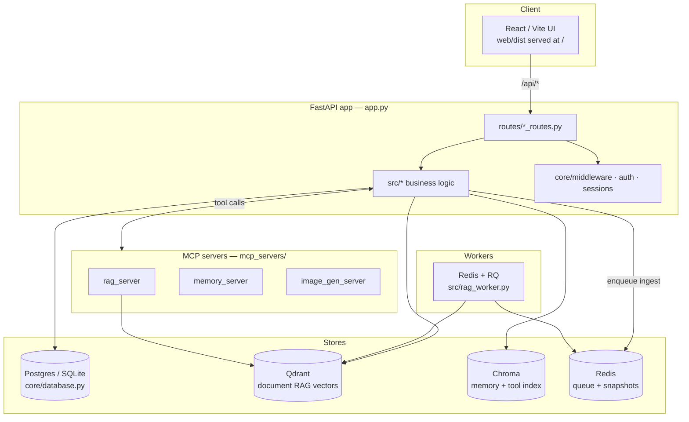

# Architecture overview

Talos is a single FastAPI application (`app.py`) that serves both the JSON API and
the compiled React frontend, backed by a handful of stateful services (Postgres/SQLite,
Qdrant, Redis, Chroma) and extended through MCP servers.

## High-level layout

## Code map

| Path | Responsibility |
|------|----------------|
| `app.py` | App construction, middleware, static mounts, lifecycle, top-level routes |
| `routes/` | One router module per feature area (`rag_routes.py`, `chat_routes.py`, `auth_routes.py`, …) |
| `src/` | Business logic: agent loop, chat processing, RAG, embeddings, documents, MCP management |
| `core/` | Cross-cutting infrastructure: `database.py`, `auth.py`, `middleware.py`, `session_manager.py`, `models.py` |
| `services/` | Long-lived services (e.g. `services/memory/`) |
| `mcp_servers/` | In-process MCP servers exposing RAG, memory, and image generation as tools |
| `web/` | React 19 + Vite + TypeScript frontend (built to `web/dist`, served at `/`) |
| `sandbox/` | Per-user isolated execution environment (separate container) |

## How the frontend and API are served

The compiled Vite bundle lives in `web/dist` and is served at `/`:

- `/` → `web/dist/index.html` (`serve_index` in `app.py`).
- `/assets/*` → content-hashed JS/CSS, cached immutably.
- `/static/*` → fonts and other static assets, revalidated on each load.
- `/docs` → **this documentation site** (static MkDocs build).
- `/api/docs` and `/api/redoc` → the interactive OpenAPI reference (see
  [API reference](../backend/api.md)).

## Request lifecycle

1. A request hits FastAPI and passes through the middleware stack in `core/middleware.py`
   (CORS, auth/session resolution, rate limiting).
2. The matching router in `routes/` validates input via Pydantic models
   (`src/request_models.py`) and delegates to logic in `src/`.
3. Business logic reads/writes the relevant store (DB, Qdrant, Chroma) or enqueues
   background work on Redis.
4. For agentic chat, `src/agent_loop.py` drives the model/tool loop, calling MCP
   servers and built-in actions as tools.

See the [RAG pipeline](rag-pipeline.md) page for the document → answer path in detail.
