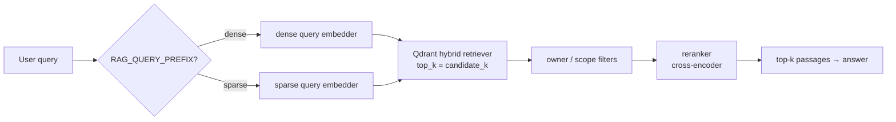

# RAG pipeline

Talos answers questions over your own documents using a **hybrid retrieval** pipeline
built on [Haystack](https://haystack.deepset.ai/) and [Qdrant](https://qdrant.tech/).
"Hybrid" means every query runs through both a **dense** (semantic) embedder and a
**sparse** (BM25-style keyword) embedder, and the two result sets are fused before an
optional cross-encoder **reranker** picks the final passages.

The implementation lives in a small cluster of modules:

| Module | Role |
|--------|------|
| `src/rag_vector.py` | `VectorRAG` — the engine: store setup, ingestion, hybrid search, reranking |
| `src/rag_manager.py` | `RAGManager` — thin stable wrapper delegating to `VectorRAG` |
| `src/rag_singleton.py` | Process-wide shared `VectorRAG` instance |
| `src/rag_worker.py` | Redis/RQ background jobs for directory & file ingestion |
| `src/document_processor.py` | File → text extraction (text, PDF, Office, image VL) |
| `src/embeddings.py` | Embedding client(s): HTTP endpoint + local FastEmbed fallback |
| `mcp_servers/rag_server.py` | Exposes RAG search to the agent as an MCP tool |
| `routes/rag_routes.py` | HTTP API for indexing, search, jobs, and diagnostics |

## Ingestion (writing to the index)

Documents are ingested asynchronously so large directories don't block a request.
`routes/rag_routes.py` enqueues a job; `src/rag_worker.py` runs it on a Redis/RQ worker
and streams progress back through Redis snapshots.

```mermaid
flowchart LR
  A[Upload / pick directory] --> B[rag_routes<br/>enqueue job]
  B --> C[(Redis + RQ)]
  C --> D[rag_worker<br/>ingest_directory_job]
  D --> E[VectorRAG.index_personal_documents]
  E --> F[document_processor<br/>extract text]
  F --> G[Docling splitter<br/>chunk into passages]
  G --> H[dense + sparse<br/>document embedders]
  H --> I[(Qdrant collection)]
  D -. progress snapshots .-> C
```

Step by step:

1. **Enqueue** — `start_index_directory` / `start_index_files` push a job onto the RQ
   queue (`src/rag_worker.py`). The API returns a job id immediately.
2. **Walk & extract** — `VectorRAG.index_personal_documents` walks the directory,
   filters by extension, and calls `document_processor` to turn each file into text.
   PDFs, Office docs, and images (via a vision-language model) are all supported.
3. **Chunk** — text is split into passages by the Docling-backed splitter.
4. **Embed** — each passage is embedded by **both** the dense document embedder and the
   sparse document embedder.
5. **Upsert** — passages + vectors + metadata (`source`, `filename`, `owner`, `type`, …)
   are written to the Qdrant collection.

Progress and cancellation are cooperative: the worker periodically writes a snapshot to
Redis (`_progress_saver`) and checks a cancel flag, so the UI can show a live percentage
and stop a run mid-flight.

### Ingest guards

Between extraction and chunking, two guards run on the extracted text (heuristics
ported from [opendataloader-pdf](https://github.com/opendataloader-project/opendataloader-pdf)):

- **Hidden-text filter** (`src/pdf_hidden_text.py`, on by default,
  `PDF_HIDDEN_TEXT_FILTER=false` to disable) — scans PDFs for text a human never sees
  (invisible render mode, white-on-white / low contrast against the rendered page,
  zero-size fonts, off-page placement) and strips it from the extracted text before it
  reaches the index or chat context. This closes the classic PDF prompt-injection
  channel. Also applied to chat attachments in `src/document_processor.py`.
- **PII redaction** (`src/ingest_redaction.py`, opt-in) — replaces emails,
  phone/card/account numbers, IPs, MACs, and URLs with typed placeholders before
  embedding. Deliberately coarse; enable for HR/customer corpora, not engineering
  ones. Toggled globally in **Settings → RAG → PII redaction** (bridged to
  `RAG_REDACT_PII`), and overridable **per upload** via the redaction selector next
  to the upload button — the choice is stamped into each file's `redact_pii`
  metadata and wins over the global toggle in either direction.

The PDF VLM lane's per-page triage (`src/pdf_page_triage.py`) also picks up
vector-drawn charts/diagrams (path objects, no raster image) and wide chart-shaped
images, in addition to the original image-area rule (`PDF_VLM_PAGE_RATIO`).

## Retrieval (answering a query)

`VectorRAG.search()` (`src/rag_vector.py:361`) is the read path:

Key behaviours worth knowing:

- **Candidate over-fetch.** `search` fetches `candidate_k` (default `k * 5`) candidates
  from Qdrant, then reranks down to `k`. More candidates → better reranking, more cost.
- **Asymmetric query prefix.** When `RAG_QUERY_PREFIX` is set (e.g. for Qwen3-Embedding),
  it is prepended to the **dense query only** — documents are embedded without it, and the
  sparse/BM25 side always uses the raw query terms.
- **Hybrid fusion.** Dense and sparse results are fused by Qdrant's hybrid retriever
  before reranking.
- **Reranking is optional.** `_rerank` calls an external reranker if `RERANK_URL` is set;
  otherwise the fused similarity order is returned as-is.
- **Multi-tenant filtering.** `owner`, `scope`, and `exclude_scopes` become Qdrant
  filters so users only retrieve their own (or in-scope) passages.

## How the agent uses it

During chat, retrieval is exposed two ways:

- As an **MCP tool** (`mcp_servers/rag_server.py`) the agent loop can call when it decides
  it needs context.
- Directly via `routes/rag_routes.py` for explicit "search my documents" UI actions; the
  `RagSources` component (`web/src/components/RagSources.tsx`) renders the cited passages.

## Configuration

RAG is driven entirely by environment variables (see `.env.example`):

| Variable | Purpose |
|----------|---------|
| `QDRANT_URL` / `QDRANT_API_KEY` | Qdrant connection. **RAG is disabled if `QDRANT_URL` is unset.** |
| `EMBEDDING_URL` / `EMBEDDING_MODEL` / `EMBEDDING_API_KEY` | Dense embedding endpoint |
| `RAG_SPARSE_MODEL` | Sparse (BM25-style) model for the keyword side |
| `RAG_QUERY_PREFIX` | Optional instruction prefix for the dense query |
| `RERANK_URL` / `RERANK_MODEL` / `RERANK_API_KEY` | Optional cross-encoder reranker |
| `FASTEMBED_MODEL` / `FASTEMBED_CACHE_PATH` | Local FastEmbed fallback embedder |

!!! note "Dimension safety"
    On startup `VectorRAG` probes the embedding dimension with the **same** dense embedder
    used for ingestion and search, and fails loudly if the endpoint is unreachable —
    rather than silently falling back to a different-sized local model and creating a
    Qdrant dimension mismatch.

## Diagnostics

`VectorRAG.get_stats()` and `src/rag_worker.diagnostics()` surface health, document
counts, the active backend, and the last error. These are exposed through
`routes/rag_routes.py` and `routes/diagnostics_routes.py` for the Settings → RAG screen.
